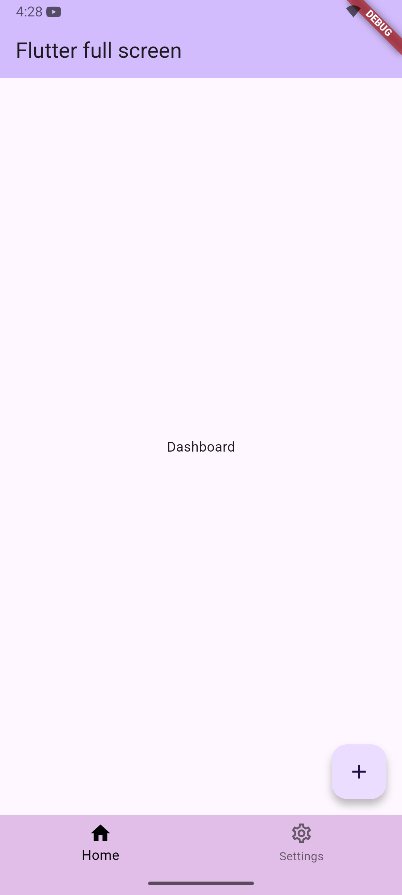
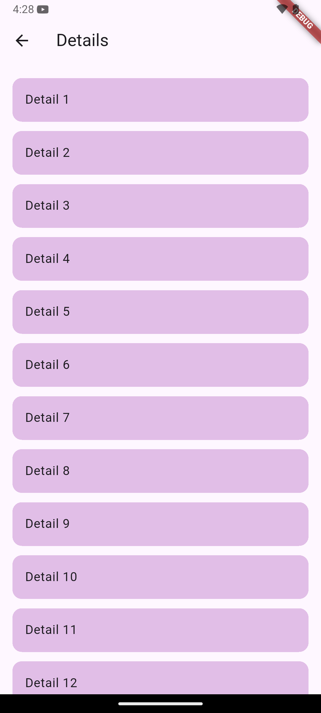
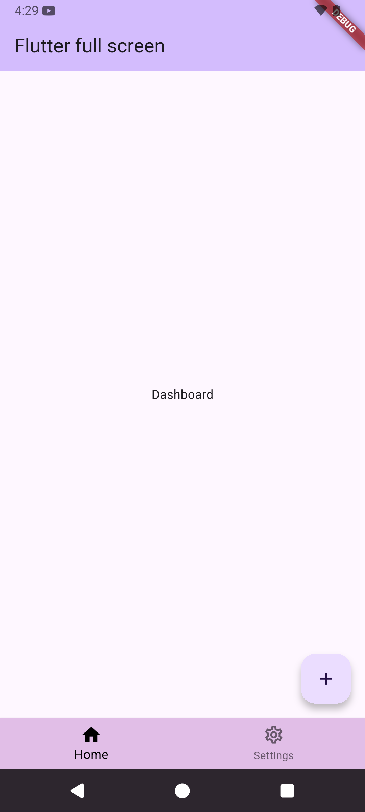
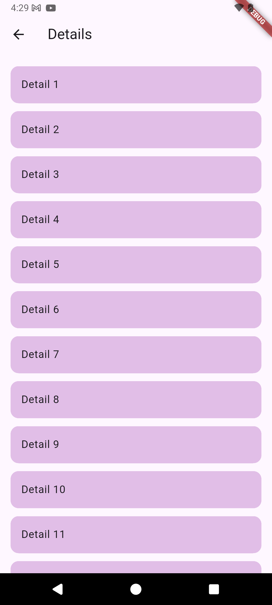

# edge_to_edge_resolver

---

A Flutter plugin that helps developers resolve **edge-to-edge rendering issues** across android devices (Android 35).  
This package provides utilities to handle safe areas, insets, and system UI overlays for a smoother full-screen app experience.


## Features

✅ Handle safe area padding automatically  
✅ Manage system UI overlays (navigation bar)  
✅ Consistent edge-to-edge layout across Android & iOS  
✅ Lightweight and easy-to-use API  


|             | Android                 | iOS               |
|-------------|-------------------------|-------------------|
| **Support** | SDK 35+ (Kotlin 1.9.22) | 13.0+ (Swift 5.0) |


---

## Installation

Add the following line to your `pubspec.yaml` under `dependencies`:

```yaml
dependencies:
  edge_to_edge_resolver: ^latest
```

Set navigation bar color:

```dart
void main() async {
  WidgetsFlutterBinding.ensureInitialized();
  EdgeToEdgeResolver.setNavigationBarColor(color: Colors.black);
  runApp(const MyApp());
}
```

Wrap your screen with EdgeToEdgeResolverWidget:

```dart
class MyHomePage extends StatelessWidget {
  const MyHomePage({super.key});

  @override
  Widget build(BuildContext context) {
    return Scaffold(
      appBar: AppBar(title: Text('Details')),
      body: EdgeToEdgeResolverWidget(
        child: Center(child: Text('Demo Full Screen'),),
      ),
    );
  }
}
```

## Contributing

Contributions are welcome!
If you find a bug or want to suggest a feature, please open an issue or submit a pull request.

# 📷 Screenshots




